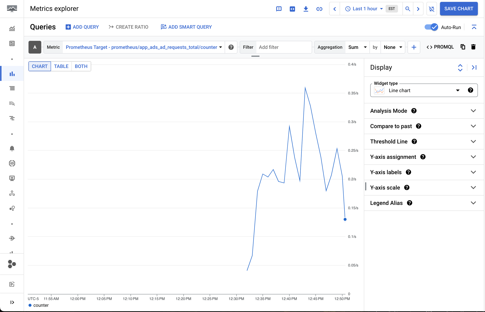
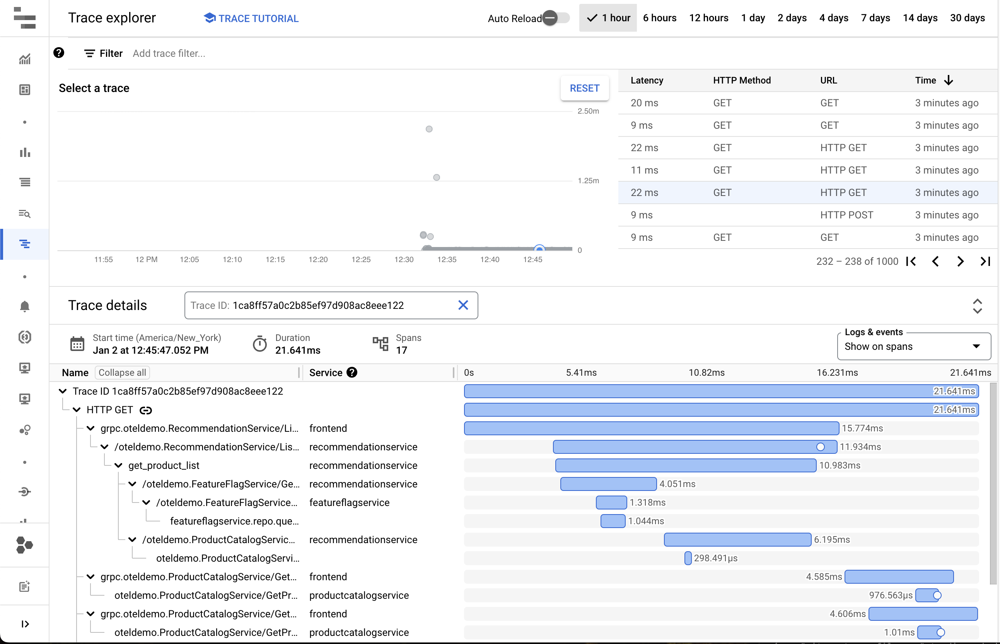
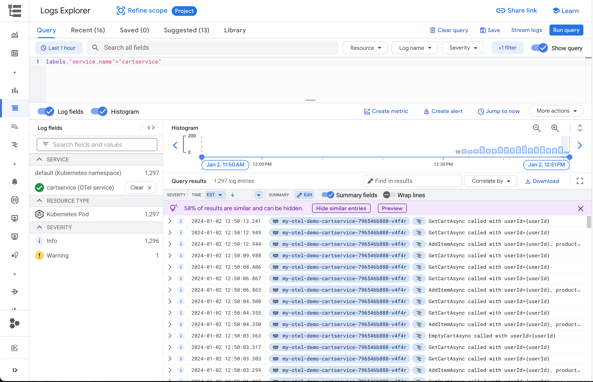

# Running the demo on Google Cloud

The demo can send logs, traces, and metrics to Google Cloud. The easiest way to
do this is with the [`gcp-config-values.yml`](gcp-config-values.yml) file (when
deploying via Helm on GKE) or
[`src/otelcollector/otelcol-config-extras.yml`](src/otelcollector/otelcol-config-extras.yml)
when running with `docker-compose` on GCE.

## Running on GKE

The recommended way to run the demo on GKE is with the official Helm chart. If
running on a GKE Autopilot cluster (or any cluster with Workload Identity), you
must follow the prerequisite steps to set up a Workload Identity-enabled service
account below. Otherwise, you can skip to the next section.

### Workload Identity prequisites

Follow the [Workload Identity
docs](https://cloud.google.com/kubernetes-engine/docs/how-to/workload-identity#authenticating_to)
to set up an IAM service account in your GCP project with permission to use
Workload Identity and write logs, traces, and metrics:

```console
export GCLOUD_PROJECT=<your project id>
```

```console
gcloud iam service-accounts create opentelemetry-demo \
    --project=${GCLOUD_PROJECT}
gcloud projects add-iam-policy-binding ${GCLOUD_PROJECT} \
    --member "serviceAccount:opentelemetry-demo@${GCLOUD_PROJECT}.iam.gserviceaccount.com" \
    --role "roles/logging.logWriter"
gcloud projects add-iam-policy-binding ${GCLOUD_PROJECT} \
    --member "serviceAccount:opentelemetry-demo@${GCLOUD_PROJECT}.iam.gserviceaccount.com" \
    --role "roles/monitoring.metricWriter"
gcloud projects add-iam-policy-binding ${GCLOUD_PROJECT} \
    --member "serviceAccount:opentelemetry-demo@${GCLOUD_PROJECT}.iam.gserviceaccount.com" \
    --role "roles/cloudtrace.agent"
gcloud iam service-accounts add-iam-policy-binding opentelemetry-demo@${GCLOUD_PROJECT}.iam.gserviceaccount.com \
    --role roles/iam.workloadIdentityUser \
    --member "serviceAccount:${GCLOUD_PROJECT}.svc.id.goog[otel-demo/opentelemetry-demo-otelcol]"
```

Update [`gcp-config-valus.yml`](gcp-config-values.yml) to annotate the
Kubernetes service account with your project:

```console
sed -i "s/%GCLOUD_PROJECT%/${GCLOUD_PROJECT}/g" gcp-config-values.yml
```

Next, when you deploy the Helm chart, the
[`gcp-config-values.yml`](gcp-config-values.yml) file will create the Kubernetes
service account and annotate it to use Workload Identity.

### Deploying the Helm chart

Follow the [OpenTelemetry docs to run the Helm chart](https://opentelemetry.io/docs/demo/kubernetes-deployment):

```console
kubectl create namespace otel-demo
helm repo add open-telemetry https://open-telemetry.github.io/opentelemetry-helm-charts
helm repo update
helm install my-otel-demo open-telemetry/opentelemetry-demo --namespace otel-demo --values gcp-config-values.yml --version 0.29.1
```

### (Alternative) Using `kubectl apply`

Installing with the Helm chart is recommended, but you can also use `kubectl apply` to install the manifests directly.

First, make sure you have followed the Workload Identity setup steps above.

Update [`gcp-config-valus.yml`](gcp-config-values.yml) to annotate the
Kubernetes service account with your project:

```console
sed -i "s/%GCLOUD_PROJECT%/${GCLOUD_PROJECT}/g" ./kubernetes/opentelemetry-demo.yaml
```

Install the manifests:

```console
kubectl apply -n otel-demo -f ./kubernetes/opentelemetry-demo.yaml
```

## Running on GCE

Follow the [OpenTelemetry docs to run with Docker](https://opentelemetry.io/docs/demo/docker-deployment/):

```console
make start
```

## Seeing telemetry

With the demo running, you should see telemetry automatically created by the
demo's load generator. You can see metrics under "Prometheus Target" in Cloud
Monitoring:



Traces in the Trace explorer:



And logs in the Logs explorer organized by service:


